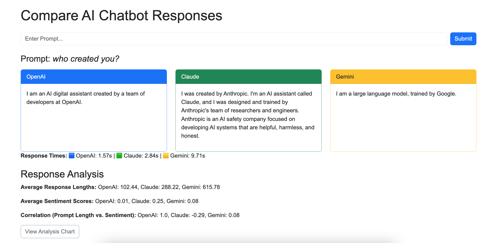

# Comparative AI Chatbot Dashboard

A web application that compares responses from OpenAI, Claude, and Gemini APIs for user-provided prompts. Built with Flask, this project demonstrates proficiency in AI API integration, web development, and secure configuration management. [View on GitHub](https://github.com/vinny990/comparative-ai-chatbot) | [Live Demo](https://vinny990-ai-chatbot-885893737143.us-central1.run.app/) (Hosted on Google Cloud Run).

## Features
- Submit a text prompt and view side-by-side responses from three AI models.
- Responsive UI built with Flask templates and Bootstrap for a clean, user-friendly interface.
- Secure API key management using python-dotenv and .env files.

## Setup
1. Clone the repository:
   ```bash
   git clone https://github.com/vinny990/comparative-ai-chatbot
   ```
2. Create and activate a virtual environment:
   ```bash
   python3 -m venv venv
   source venv/bin/activate
   ```
3. Install dependencies:
   ```bash
   pip install -r requirements.txt
   ```
4. Copy `.env.example` to `.env` and add your API keys (no spaces around `=`):
   ```bash
   cp .env.example .env
   ```
   Edit `.env` with your keys:
   ```env
   OPENAI_API_KEY=your_key
   ANTHROPIC_API_KEY=your_key
   GEMINI_API_KEY=your_key
   ```
   Obtain keys from:
   - [OpenAI](https://platform.openai.com/account/api-keys)
   - [Anthropic (Claude)](https://console.anthropic.com/)
   - [Google Gemini](https://makersuite.google.com/app/apikey)
5. Run the app:
   ```bash
   python3 app.py
   ```
6. Open [http://localhost:5000](http://localhost:5000) in your browser.

## Technologies
- Languages: Python, HTML, CSS
- APIs: OpenAI (ChatGPT), Anthropic (Claude), Google Gemini
- Frameworks/Libraries: Flask (2.0.1), Werkzeug (2.0.3), requests (2.28.1), python-dotenv (0.20.0), gunicorn (20.1.0), Bootstrap
- Tools: Git, Heroku (planned for deployment)

## Example
**Prompt**: "Write a haiku about the moon."  
**OpenAI Response**: Soft light in the night, Moon whispers dreams to the stars, Glowing dreams take flight.  
**Claude Response**: Lunar whispers sing, In night's embrace, shadows dance, Glowing dreams take wing.  
**Gemini Response**: Moonlight's gentle glow, Casting dreams in silver hues, Night's calm whispers flow.

## Screenshots


## Status
- Local development complete with functional Flask app and API integrations.
- Next steps: Deploy to Heroku for a live demo and add response time visualization with Chart.js.
