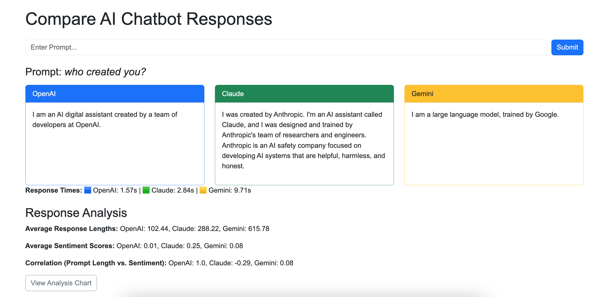

# Comparative AI Chatbot Dashboard

A web application that compares responses from OpenAI, Claude, and Gemini APIs for user-provided prompts. Built with Flask, this project demonstrates proficiency in AI API integration, web development, and secure configuration management. [View on GitHub](https://github.com/vinny990/comparative-ai-chatbot) | [Live Demo](https://comparative-ai-chatbot.onrender.com) (Hosted on Render).

## Features
- Submit a text prompt and view side-by-side responses from three AI models.
- Responsive UI built with Flask templates and Bootstrap for a clean, user-friendly interface.
- Secure API key management using python-dotenv and .env files.

## Models Used
- **OpenAI**: gpt-4o-mini
- **Anthropic (Claude)**: claude-haiku-4-5-20251001
- **Google Gemini**: gemini-2.5-flash

## Setup
1. Clone the repository:
   ```bash
   git clone https://github.com/vinny990/comparative-ai-chatbot
   ```
2. Create and activate a virtual environment:
   ```bash
   python3 -m venv venv
   source venv/bin/activate
   ```
3. Install dependencies:
   ```bash
   pip install -r requirements.txt
   ```
4. Create a `.env` file and add your API keys:
   ```env
   OPENAI_API_KEY=your_key
   ANTHROPIC_API_KEY=your_key
   GEMINI_API_KEY=your_key
   ```
   Obtain keys from:
   - [OpenAI](https://platform.openai.com/account/api-keys)
   - [Anthropic (Claude)](https://console.anthropic.com/)
   - [Google Gemini](https://aistudio.google.com/app/apikey)
5. Run the app:
   ```bash
   python3 app.py
   ```
6. Open [http://localhost:8080](http://localhost:8080) in your browser.

## Deployment (Render)
1. Push repo to GitHub.
2. Go to [render.com](https://render.com) → New → Web Service → connect repo.
3. Render will auto-detect `render.yaml` (Docker runtime).
4. Add environment variables in the Render dashboard:
   - `OPENAI_API_KEY`
   - `ANTHROPIC_API_KEY`
   - `GEMINI_API_KEY`
5. Deploy.

> **Note:** SQLite database (`responses.db`) is ephemeral on Render's free tier and resets on redeploy. Add a Render Disk for persistence.

## Technologies
- Languages: Python, HTML, CSS
- APIs: OpenAI (gpt-4o-mini), Anthropic (claude-haiku-4-5), Google Gemini (gemini-2.5-flash)
- Frameworks/Libraries: Flask, gunicorn, requests, python-dotenv, Bootstrap
- Tools: Git, Docker, Render

## Example
**Prompt**: "Write a haiku about the moon."
**OpenAI Response**: Soft light in the night, Moon whispers dreams to the stars, Glowing dreams take flight.
**Claude Response**: Lunar whispers sing, In night's embrace, shadows dance, Glowing dreams take wing.
**Gemini Response**: Moonlight's gentle glow, Casting dreams in silver hues, Night's calm whispers flow.

## Screenshots


## Status
- All three AI integrations working locally.
- Deployed on Render (migrated from Google Cloud Run).
